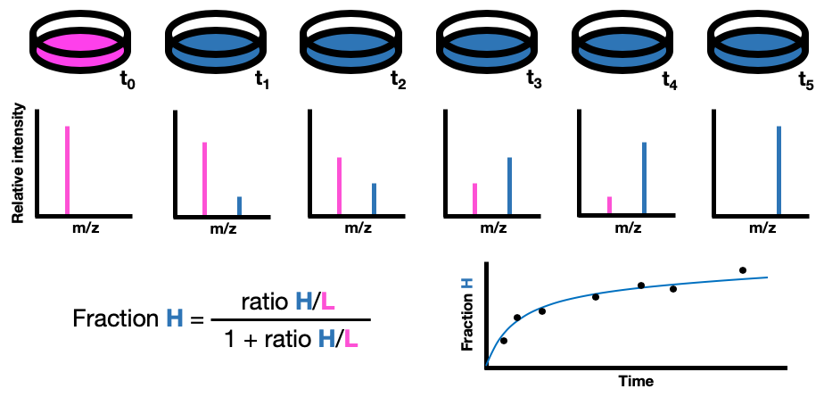
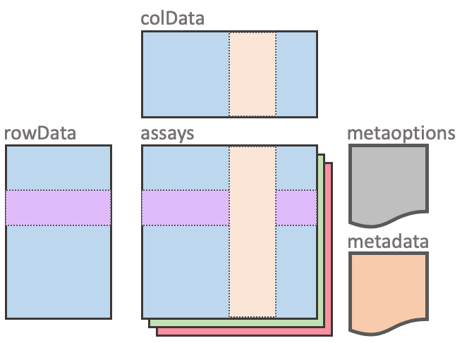
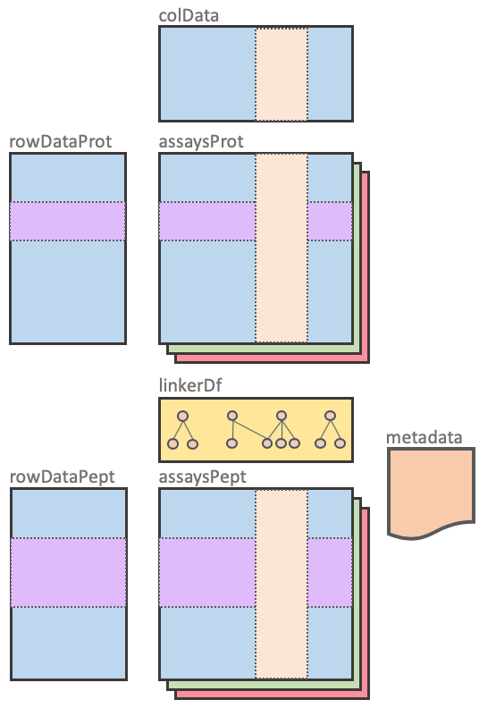

# Installation

To install this package, start R (version "3.6") and enter:

```{r, eval = FALSE}

if (!requireNamespace("BiocManager", quietly = TRUE))
    install.packages("BiocManager")

BiocManager::install("pulsedSilac")

```


# Introduction

SILAC (Stable Isotope Label by Amino acids in Cell culture) is a method to differentially compare protein expression between samples. To measure protein turnover, the SILAC technique is applied over time by changing the medium and harvesting the cells at different time points. Each sample is then analyzed by mass spectrometry. The isotope ratio at each time point can then be used to calculate the turnover rate of each measured protein. 



This package contains a set of functions to analyze pulsed SILAC quantitative data. Functions are provided to organize the data, calculate isotope ratios, isotope fractions, model protein turnover, compare turnover models, estimate cell growth and estimate isotope recycling. Several visualization tools are also included to do basic data exploration, quality control, condition comparison, individual model inspection and model comparison.

# Data organization

Many Bioconductor packages use `SummarizedExperiment` objects or derivatives from it to organize omics data. This is a rectangular class of object that contains assays (matrix-like organized data) in which rows represent features (genes, proteins, metabolites, ...) and columns represent samples. If you are unfamiliar with this format, please read this introductory [vignette](https://bioconductor.org/packages/3.8/bioc/vignettes/SummarizedExperiment/inst/doc/SummarizedExperiment.html).

This package uses two `SummarizedExperiment` derived classes: `ProteinExperiment` and `PeptideExperiment`. It also introduces a new class, the `ProteomicsExperiment`, which encapsulates both the previous classes.

## `ProteinExperiment` and `PeptideExperiment`

The `ProteinExperiment` and `PeptideExperiment` are, as their name indicates, to store either protein or peptide related data. These two objects are almost identical to a `SummarizedExperiment` object. Their only difference is the addition of a new slot called `metaoptions`. This slot contains a name `list` which contains values that are indicative of where certain information, required for the analysis, is located in the object. For example, the `conditionCol` value is used to indicate which column of `colData` has the information about the different experiment conditions.




### Object construction

Constructing a `ProteinExperiment` or a `PeptideExperiment` is extremely similar to constructing a `SummarizedExperiment`. The only additional arguments are the different `metaoptions` values. 

Here is an example of constructing a `ProteinExperiment`:

```{r, message = FALSE}
require(pulsedSilac)

## assays
assays_protein <- list(expression = matrix(1:9, ncol = 3))

## colData
colData <- data.frame(sample = c('A1', 'A2', 'A3'),
                      condition = c('A', 'A', 'A'),
                      time = c(1, 2, 3))
## rowData
rowData_protein <- data.frame(prot_id = LETTERS[1:3])

## construct the ProteinExperiment
protExp <- ProteinExperiment(assays = assays_protein, 
                             rowData = rowData_protein, 
                             colData = colData, 
                             conditionCol = 'condition', 
                             timeCol = 'time')
protExp
```

Here is an example of constructing a `PeptideExperiment`:

```{r}

## assays
assays_peptide <- list(expression = matrix(1:15, ncol = 3))

## colData
colData <- data.frame(sample = c('A1', 'A2', 'A3'),
                      condition = c('A', 'A', 'A'),
                      time = c(1, 2, 3))
## rowData
rowData_peptide <- data.frame(pept_id = letters[1:5], 
                              prot_id = c('A', 'A', 'B', 'C', 'C')) 
## construct the ProteinExperiment
peptExp <- PeptideExperiment(assays = assays_peptide, 
                             rowData = rowData_peptide, 
                             colData = colData, 
                             conditionCol = 'condition', 
                             timeCol = 'time')
peptExp
```

### Accessor functions

The accessor functions are exactly the same as in a `SummarizedExperiment` object, these are mainly: `rowData()`, `colData()`, `assays()` and `metadata()`. To access the `metaoptions` slot the `metaoptions()` function can be used.

```{r}
## assays
assays(protExp)
assays(peptExp)
```

```{r}
## rowData
rowData(protExp)
rowData(peptExp)
```

```{r}
## colData
colData(protExp)
colData(peptExp)
```

```{r}
## metaoptions
metaoptions(protExp)

metaoptions(peptExp)[['proteinCol']] <- 'prot_id'
metaoptions(peptExp)
```

### Subsetting and aggregation

Similarly to the accessor function, most of the `SummarizedExperiment` operations, such as subsetting and aggregating, can be applied to the two classes. For subsetting these are mainly: `[`, `subset`, `$`; and for aggregation these are mainly: `cbind`, `rbind` and `merge`. For a more detailed explanation please refer to the manual. 

```{r}
## subsetting by rows and columns
protExp[1, 1:2]
peptExp[1, 1:2]

## subsetting by rows based on rowData
subset(protExp, prot_id == 'A')
subset(peptExp, pept_id %in% c('a', 'b'))

## quick acces to colData
protExp$sample
peptExp$condition
```

```{r}
## combining by columns
cbind(protExp[, 1], protExp[, 2:3])

## combining by rows
rbind(peptExp[1:3, ], peptExp[4:5, ])

## combine rows and columns
merge(peptExp[1:3, 1], peptExp[3:5, 2:3])
```


## `ProteomicsExperiment`

The `ProteomicsExperiment` object contains both a `ProteinExperiment` and a `PeptideExperiment` object. Therefore it can be used to store both levels of information in a single object. The protein and peptide level are aligned/linked by the `colData` slot and by the `linkerDf` slot. The `linkerDf` slot contains a `data.frame` that indicates which indicates which peptides are assigned to each protein and *vice versa*.



### Object construction

To construct a `ProteomicsExperiment` we need noth a `ProteinExperiment` object and a `PeptideExperiment` object.

```{r}
ProteomicsExp <- ProteomicsExperiment(ProteinExperiment = protExp, 
                                      PeptideExperiment = peptExp)
ProteomicsExp
```

In this case, the levels are only aligned by columns. There is no information on which are the relationships between proteins and peptides. This information can be added in the `linkerDf` slot. Which contains a `data.frame` that indicates the relationships between the two levels features. One can be constructed with the `buildLinkerDf()` function.

```{r}
## list with the relationships
protein_to_peptide <- list(A = c('a', 'b'), B = c('c'), C = c('d', 'e'))
## function to build the data.frame
linkerDf <- buildLinkerDf(protIDs = LETTERS[1:3], 
                          pepIDs  = letters[1:5], 
                          protToPep = protein_to_peptide)
linkerDf

ProteomicsExp <- ProteomicsExperiment(ProteinExperiment = protExp, 
                                      PeptideExperiment = peptExp, 
                                      linkerDf = linkerDf)
```

Linked `ProteomicsExperiment` objects can be useful to apply linked subsetting operations or to recalculate protein level data from peptide data.

### Accessor functions

If the slot is general to the `ProteomicsExperiment` object then the same functions as in a `SummarizedExperiment` can be used.

```{r}
## colData
colData(ProteomicsExp)
```


```{r}
## linkerDf
linkerDf(ProteomicsExp)
```

```{r}
## metadata
metadata(ProteomicsExp)
```


```{r}
## metaoptions
metaoptions(ProteomicsExp)
```

But for protein/peptide shared slots names, like `assays` and `rowData`, there are two options to access them. Using the `SummarizedExperiment` generic will return a named list with the two elements.

```{r}
## assays
assays(ProteomicsExp)
```

```{r}
## rowData
rowData(ProteomicsExp)
```

To access specifically a slot of protein or peptide level one can use the same functions and just add `Prot` or `Pept` as suffixes.

```{r}
## assays of protein level
assaysProt(ProteomicsExp)

## assays of peptide level
assaysPept(ProteomicsExp)
```

```{r}
## rowData of protein level
rowDataProt(ProteomicsExp)

## rowData of peptide level
rowDataPept(ProteomicsExp)
```

And finally to extract the `ProteinExperiment` and `PeptideExperiment` back one can use the `ProtExp` and `PeptExp` functions.

```{r}

ProtExp(ProteomicsExp)

PeptExp(ProteomicsExp)

```

### Subsetting and aggregation

When subsetting row-wise on a `ProteomicsExperiment` there will be two main questions: 

- To which level is the subset applied?
- Is the subset from one level applied also to the other? For example, when I subset a protein, do I want to subset also only the peptides related to that protein.

The answer to these questions is written in the `metaoptions` values. The first one is `subsetMode` which can be `protein` or `peptide`. The second one is `linkedSubset`, which can be `TRUE` or `FALSE`. Moreover, if the latter is set to `TRUE` then the `idColProt` and `idColPept` will also be required.

Here are some examples of using the `[` in different situations.

Subset at protein level without affecting the peptide level.

```{r}
## indicate which rowDat columns have unique ids for proteins and peptides
metaoptions(ProteomicsExp)[['idColProt']] <- 'prot_id'
metaoptions(ProteomicsExp)[['idColPept']] <- 'pept_id'
## indicate that we want to apply the subset at protein level
metaoptions(ProteomicsExp)[['subsetMode']] <- 'protein'
## and not extend it to the peptide level
metaoptions(ProteomicsExp)[['linkedSubset']] <- FALSE

ProteomicsExp[1:2,]
```

It can be seen that the protein level has two proteins while the peptide level kept all five peptides.

Subset at protein level and extending the subset to the peptide level.

```{r}
## to extend we set the metaoption to TRUE
metaoptions(ProteomicsExp)[['linkedSubset']] <- TRUE

ProteomicsExp[1:2,]
```

In this case the protein level has two proteins and the peptide level has also been subset to the three peptides that are assigned to the two proteins in the `linkerDf`. 

The same process can also be applied at peptide level.
```{r}
## indicate that we want to apply the subset at protein level
metaoptions(ProteomicsExp)[['subsetMode']] <- 'peptide'
## to extend we set the metaoption to TRUE
metaoptions(ProteomicsExp)[['linkedSubset']] <- TRUE

ProteomicsExp[1:2,]
```
In this case, the first two peptides are selected, these belong to the first protein which is also selected.

Other subset operations can be done using `subsetProt()` and `subsetPep()`, which call the generic `subset()` on the `rowData` slot of the protein and peptide level respectively. Note that `subsetProt()` and `subsetPep()` will behave differently depending on the metaoption `linkedSubset` as seen above with `[`.


```{r}
## without linked Subset
metaoptions(ProteomicsExp)[['linkedSubset']] <- FALSE
subsetProt(ProteomicsExp, prot_id == 'B')
```

```{r}
## with linked Subset
metaoptions(ProteomicsExp)[['linkedSubset']] <- TRUE
subsetProt(ProteomicsExp, prot_id == 'B')
```

Finally for aggregating `cbind`, `rbind` and `merge` can be used.

For `cbind` the number of proteins and peptides must be the same and they are expected to be in the same order.

```{r}
## cbind
cbind(ProteomicsExp[,1], ProteomicsExp[,2])
```

For `rbind` the number of samples must be the same and they are expected to be in the same order.

```{r}
## rbind
rbind(ProteomicsExp[1:2,], ProteomicsExp[3,])
```

`merge` can be used when samples have to be aggregated in one object but the proteins/peptides are not the same. It requires IDs that can be matched between experiments.

```{r}
## merge
merge(ProteomicsExp[1:3,1], ProteomicsExp[3:4, 2:3])
```

## `metaoptions`

The `metaoptions` slot contains a `list` with a set of "option" values used to indicate where critical analysis information is required. The idea is that these values are defined at the beginning of the analysis so that it is not required to give them as arguments in each function call. Nevertheless, all the analysis functions can have these values passed as arguments. There are several `metaoptions` values by default, some or them are shared between the three classes while others are unique.

The following are related to data analysis:

- `conditionCol`: which column in `colData` indicates the different experiment conditions.
- `timeCol`: which column in `colData` indicates the different timepoints of the experiment.
- `proteinCol`:  which column in `rowData` indicates the assigned protein to a peptide. (unique to `PeptideExperiment`)

The following are related to `ProteomicsExperiment` subsetting operations:

- `idColProt`: which column in `rowDataProt` indicates unique protein IDs. (unique to `ProteomicsExperiment`)
- `idColPept`: which column in `rowDataPept` indicates unique peptide IDs. (unique to `ProteomicsExperiment`)
- `linkedSubset`: logical that indicates if the subsetting operation should be applied to both data levels (protein and peptide). (unique to `ProteomicsExperiment`)
- `subsetMode`: which level should be used for reference when subsetting (protein or peptide). (unique to `ProteomicsExperiment`)

These can be extended by the user to accomodate other experiment design and data analysis operations.

# Example data

```{r, echo = FALSE}
## load objects required for the vignette
data('wormsPE')
data('mefPE')
data('recycleLightLysine')
```

To demonstrate the use of the package functions, a reduced version of the pulsed-SILAC dataset from @Visscher2016 has been built into a `ProteomicsExperiment` object. It is stored in an object named `wormsPE`. This object has been constructed from the output files from MaxQuant 'proteinGroups.txt' and 'peptides.txt'.

```{r}
wormsPE
```

The dataset contains only the first 250 proteins and their corresponding peptides. It has 4 assays with the total intensity, light isotope and heavy isotope intensities and heavy/light isotope ratio. In the experiment there are 2 cell lines: OW40, which express $\alpha$-synuclein-YFP (model for Parkinson's Disease) and OW450, which express YFP only. Worms were harvested after 4h, 6h, 8h, 13h, 24h, 28h and 32h of light to heavy isotope medium transition.

# Filtering

## Measurements across time

To model a protein's turnover several timepoints are required. Ideally a protein would be measured in all the timepoints of the experiment, but this is rarely the case. To count how many proteins/peptides have been measured in each sample the `barplotCounts()` can be used.

```{r}
barplotCounts(wormsPE, assayName = 'ratio')
```

There is some variability between samples but nothing too extreme. More importantly is knowing if a protein has been measured across different timepoints. The function `barplotTimeCoverage()` can be used to visualize in how many timepoints each protein has been measured per condition.

```{r}
barplotTimeCoverage(wormsPE, assayName = 'ratio')
```

As it can be seen, most of the proteins are not measured at all timepoints. In this case there is a majority for proteins that have not been measured in any timepoint, this is because the dataset has been truncated for only the OW40 and OW450 lines. The original search was one with additional worm lines and these missing proteins were detected in the excluded lines.

To filter proteins that have not been detected in enough timepoints the `filterByMissingTimepoints()` function can be used. With `maxMissing` the amount of missing values can be tuned. With `strict` proteins have to meet the maxMissing criteria only in one condition or in all.

```{r}

wormsPE2 <- filterByMissingTimepoints(wormsPE, 
                                      assayName = 'ratio', 
                                      maxMissing = 2, 
                                      strict = FALSE)

barplotTimeCoverage(wormsPE2, assayName = 'ratio')

```

Because `strict` is set to `FALSE`, there are still some proteins that have been detected in less than 5 timepoints in one of the conditions. To visualize the overlap between conditions, the `upsetTimeCoverage()` function can be used. This can be specially useful when more the experiment contains more than two conditions. Here the overlap of proteins is shown.

```{r}

upsetTimeCoverage(ProtExp(wormsPE2), 
                  assayName = 'ratio', 
                  maxMissing = 2)

```

In this case there are 68 proteins that have been measured in at least 5 out of 7 timepoints in both conditions. These would be proteins for which turnover models can be compared between conditions.

Filtering by missing timepoints can also be done at peptide level if desired by changing `subsetMode` to `peptide`.

## Other filters

Other filters can be easily applied using the `subset` method. For example, proteins with a low amount of unique peptides can be filtered out.

```{r, eval = FALSE}

subsetProt(wormsPE, Unique.peptides > 2)

```

Also proteins that are known contaminants or identified using the reverse database.

```{r, eval = FALSE}

subsetProt(wormsPE, Potential.contaminant != '+')
subsetProt(wormsPE, Reverse != '+')


```

# Ratio and fraction calculation

To model protein turnover isotope fractions at each timepoint are used. The isotope fraction can be calculated in many ways. A simple approach is to derive them from isotope ratios, which many raw mass spectrometry data analysis software report. If not, one can use the `calculateIsotopeRatio()` function, which will add a new assay named `ratio` to the object. In this example, the ratio of newly synthesized protein (heavy isotope) over old protein (light isotope) will be used.

```{r, eval = FALSE}

## calculate the ratio of new istope over old isotope
wormsPE <- calculateIsotopeRatio(x = wormsPE, 
                                 newIsotopeAssay = 'int_heavy', 
                                 oldIsotopeAssay = 'int_light')

```

$$ratio = \frac{isotope_{A}}{isotope_{B}}$$

And then the fraction can be calculated as follows:

$$fraction_{A} = \frac{ratio}{1 + ratio}$$

This can be easily done using the `calculateIsotopeFraction()` function, which adds a new assay named `fraction`. In this case the heavy isotope fraction is calculated, the light isotope fraction would just be 1-fraction<sub>A</sub>. 

```{r, eval = TRUE}

wormsPE <- calculateIsotopeFraction(wormsPE, ratioAssay = 'ratio')

assaysProt(wormsPE)
assaysPept(wormsPE)

```

Unfortunately, this approach might miss some values because of the mass spectrometry nature (bias towards high abundance). For example: if a protein has a very slow turnover rate, it might be that at the earliest timepoint, the new isotope signal was under the detection limit and a ratio could not be calculated. To also account for these proteins the `calculateIsotopeFraction` function has additional arguments to indicate which assays contain each isotope's expression data and which timepoints are considered "early" or "late". 

```{r, eval = FALSE}

wormsPE <- calculateIsotopeFraction(wormsPE, 
                                    newIsoAssay = 'int_heavy',
                                    oldIsoAssay = 'int_light',
                                    earlyTimepoints = 1,
                                    lateTimepoints = 7)

```

# Plotting assays

To visualize data stored in the `assays` slot there are two functions `plotDistributionAssay()` and `scatterCompareAssays()`. The first one will plot the distributions of the data for a selected assay for each timepoint and condition. The latter will plot each protein/peptide value of a condition against the other for each timepoint.

## `plotDistributionAssay()`

```{r, warning = FALSE}

plotDistributionAssay(wormsPE, assayName = 'fraction')

```

From this plot it can already be seen that the OW450 line has a much faster heavy label incorporation that the OW40 line.

## `scatterCompareAssays()`

For `scatterCompareAssays()` it is necessary to indicate which conditions should be compared. To make it simpler, only the protein data will be used.

```{r}

protPE <- ProtExp(wormsPE)

scatterCompareAssays(x = protPE, 
                     conditions = c('OW40', 'OW450'), 
                     assayName = 'ratio')

```

This plot shows that the OW450 has a faster incorporation of heavy label than the OW40 line.

```{r}

scatterCompareAssays(x = protPE, 
                     conditions = c('OW40', 'OW450'),
                     assayName = 'int_total')

```

This plot shows that both the OW450 and OW40 have similar total protein expression over time.


# Model protein turnover

To estimate protein turnover rate the `modelTurnover()` function can be used. Parameter fitting is done using the `nls` function, or the `nlrob` function from `robustbase` for robust modelling. The `formula`, `start` and `...` arguments are passed into these functions. By default an exponential decay model is used, but it has been shown that some proteins follow other kinetics @McShane2016.

```{r, warning = FALSE}

modelList <- modelTurnover(x = wormsPE, 
                           assayName = 'fraction',
                           formula = 'fraction ~ 1 - exp(-k*t)',
                           start = list(k = 0.02),
                           mode = 'protein',
                           returnModel = TRUE)

```

## Output of `modelTurnover()`

The output of `modelTurnover()` is a list with the main model metrics: 

- `residuals`: a matrix of the same dimensions as `x` with the model residuals.
- `stderror`: a matrix with the standard error of each model.
- `param_values`: a matrix with the estimated parameter values of each model.
- `param_pval`: a matrix with the p-value of each parameter of each model.
- `param_tval`: a matrix with the t-statistic of each parameter of each model.
- `param_stderror`: a matrix with the standard error of each parameter of each model.

Models that fail to converge have `NA` as their output metrics. 

There are more options to tune `modelTurnover()`, such as: `robust`, to use robust modelling; `returnModel`, which will return the actual model objects besides the metrics; `verbose`, to output a progress bar. For more information please refer to the manual.

## Calculating protein half-life

To calculate protein half-life one has to separate the time variable on to one side of the equation and solve it. For this particula exponential decay model that has been applied it is quite simple. The new equation would be:

$$t = \frac{log(0.5)}{-k}$$

With this formula the half-life of each protein can be calculated. Here it is calculated and added to the `modelList` object. In this way, the following plots can also be used on the protein half-life data.

```{r}
modelList[['half_life']] <- log(0.5)/(-modelList$param_values$k)

```

## Plots

The output of `modelTurnover()` with `returnModel = TRUE` can be used as input in the following functions to plot either individual protein/peptides models or the overall experiment distributions. 

All the following function return objects of class `ggplot`, therefore their theme, scale, labels, etc. can be customized further customized. Moreover, if the argument `returnDataFrame` is set to `TRUE`, the `data.frame` used in the plot function will be returned instead.

### Individual models

To plot individual models the `plotIndividualModel()` function can be used. As input it requires the `Experiment` object that was used in the `modelTurnover()` call and its output. This function also requires `returnModel = TRUE`.

```{r, warning = FALSE}

modelList <- modelTurnover(x = wormsPE, 
                           assayName = 'fraction',
                           formula = 'fraction ~ 1 - exp(-k*t)',
                           start = list(k = 0.02),
                           mode = 'protein', 
                           returnModel = TRUE)

plotIndividualModel(x = wormsPE, 
                    modelList = modelList, 
                    num = 2)

```

The plot shows the quantification data as dots and the fitted model as a curve. If the models are based on grouped peptide data then the values of each peptide are plotted as dots.

```{r, warning = FALSE}

## to indicate which column of rowDataPept indicates the assigned protein
metaoptions(wormsPE)[['proteinCol']] <- 'Protein.group.IDs'
modelList <- modelTurnover(x = wormsPE, 
                           assayName = 'fraction',
                           formula = 'fraction ~ 1 - exp(-k*t)',
                           start = list(k = 0.02),
                           mode = 'grouped', 
                           returnModel = TRUE)

plotIndividualModel(x = wormsPE, 
                    modelList = modelList, 
                    num = 2)

```

### Distributions

To plot the overall distributions of the model metrics per condition the `plotDistributionModel` function can be used. This can show global changes between conditions and/or can be used for quality control. Some metrics that might be interesting to check are the R<sup>2</sup> error of the models, the estimated parameters, the residuals and the weights (only for robust modelling).

In this case, both the outputs of `modelTurnover()` with `returnModel = TRUE` or with `returnModel = FALSE` will work.

#### R<sup>2</sup> error


```{r, eval = TRUE, include = TRUE, warning = FALSE}
modelList <- modelTurnover(x = wormsPE, 
                           assayName = 'fraction',
                           formula = 'fraction ~ 1 - exp(-k*t)',
                           start = list(k = 0.02),
                           mode = 'protein', 
                           robust = TRUE,
                           returnModel = TRUE)

```

This plot shows the distribution of the error of all the models for each condition.

```{r, warning = FALSE, message = FALSE}

plotDistributionModel(modelList = modelList,
                 value = 'stderror',
                 plotType = 'density')

```

#### Turnover rate

This plot shows the distribution of the values for every fitted parameter. In this case there is only one: the turnover rate (**k**).

```{r, warning = FALSE, message = FALSE}

plotDistributionModel(modelList = modelList,
                 value = 'param_values',
                 plotType = 'density')

```

#### Residuals

This plot shows the distribution of residuals at each timepoint for each condition.

```{r, warning = FALSE, message = FALSE}

plotDistributionModel(modelList = modelList,
                      value = 'residuals',
                      plotType = 'density')

```

#### Weights

This plot shows the distribution of weights at each timepoint for each condition. This is only available if robust modelling is used.

```{r, warning = FALSE, message = FALSE}

plotDistributionModel(modelList = modelList,
                      value = 'weights',
                      plotType = 'density')

```

#### Half-lives

This plot shows the distribution of half-lives for each condition. 

```{r,echo=FALSE}
modelList[['half_life']] <- log(0.5)/(-modelList$param_values$k)

```

```{r, warning = FALSE, message = FALSE}

plotDistributionModel(modelList = modelList,
                      value = 'half_life',
                      plotType = 'density')

```

### Comparing conditions

To plot protein/peptide values and compare between conditions the `scatterCompareModels()` function can be used. It works like the `scatterCompareAssays()` function. The two conditions to be compared must be indicated as well as the desired metric.

```{r}

scatterCompareModels(modelList = modelList, 
                     conditions = c('OW40', 'OW450'), 
                     value = 'param_values')

scatterCompareModels(modelList = modelList, 
                     conditions = c('OW40', 'OW450'), 
                     value = 'stderror')
```

## Comparing models

It might be that some proteins follow a specific turnover model, while other follow a different one. In that case, one can run `modelTurnover()` for each different model and then compare the models for each protein. One metric often used to compare models is the Akaike Information Criteria (AIC). It can be calculated using the `calculateAIC()` function. Afterwards the probability of each model relative to the rest can be calculated with the `compareAIC()` function.

### Calculating the AIC

To calculate the AIC the output from `modelTurnover()` can be used. The formula used to calculate it is the following:

$$AIC = 2k - 2ln(logLik)$$

There is also a formula that applies a small sample size correction:

$$AICc = AIC + \frac{2k(k + 1)}{n - k - 1}$$

Where *k* is the number of parameters and *n* is the number of observations (timepoints in this case).

```{r, warning = FALSE, message = FALSE}

modelList <- calculateAIC(modelList, smallSampleSize = TRUE)

```

The output will be the same given list plus an additional matrix with the AIC values for each model and condition.

```{r}

names(modelList)

```

```{r, warning = FALSE, message = FALSE}

plotDistributionModel(modelList = modelList, value = 'AIC')

```

### Relative model probabilities

After the AICs have been calculated, the probability of a model relative to the others can be calculated. This is done using the `compareAIC` function. This probability can be calculated using the following formula:

$$\prod AIC_{i} = \frac{exp(\frac{AIC_{min}-AIC_{i}}{2})}{\sum_{j}exp(\frac{AIC_{min}-AIC_{j}}{2})} $$

The `compareAIC` function uses as input an indefinite number of modelLists that have been processed through the `calculateAIC` function, and it returns a list of matrices with the relative probability of each model (columns) for each protein/peptide (rows).

```{r, warning = FALSE, include=TRUE}
modelList1 <- modelTurnover(x = wormsPE, 
                            assayName = 'fraction',
                            formula = 'fraction ~ 1 - exp(-k*t)',
                            start = list(k = 0.02),
                            mode = 'protein', 
                            robust = FALSE,
                            returnModel = TRUE)
modelList1 <- calculateAIC(modelList = modelList1, 
                           smallSampleSize = TRUE)

modelList2 <- modelTurnover(x = wormsPE, 
                            assayName = 'fraction',
                            formula = 'fraction ~ 1 - exp(-k*t) + b',
                            start = list(k = 0.02, b = 0),
                            mode = 'protein', 
                            robust = FALSE,
                            returnModel = TRUE)

modelList2 <- calculateAIC(modelList = modelList2, 
                           smallSampleSize = TRUE)
```

Here is an small example in which two different models have been applied.

```{r, warning = FALSE, message = FALSE}

modelProbabilities <- compareAIC(modelList1, modelList2)

plotDistributionModel(modelList = modelProbabilities, 
                      value = 'aicprobabilities', 
                      returnDataFrame = FALSE)

```

The plot shows that model1 is the preferred model of the two in both conditions for most proteins, but there are some that have a better model with the `b` parameter.

# Cell growth estimation

During most pulsed-SILAC experiment cells will keep dividing. This means that protein synthesis will be greater than protein degradation. When comparing conditions in which cells divide at similar rates this effect can be neglected. But if cell growth is different between conditions then steady-state protein turnover will be ofuscated by the difference in protein synthesis due to cell growth.

This issue can be corrected by using a turnover model which takes cell growth into consideration. For example, by adding the cell growth rate into the model (where t<sub>cc</sub> is the cell division average time):

$$f(H) = 1 - e^{-(k + \frac{log 2}{t_{cc}})t}$$

If this information is not available, the `estimateCellGrowth()` function can be used. This function will fit an exponential degradation model based on the `n` most stable proteins (proteins which are measured in all time points and have the slowest new isotope incorporation). The rationale behind this approach is that the most stable proteins are very slowly degraded (for example structural proteins), but new proteins need to be synthesized for the daughter cells. Therefore, these proteins can be used to infer cell growth.

## Example data

For the current dataset, cell division was not an issue since adult worms do no longer divide. To illustrate the effects of cell growth data of mouse embryonic fibroblasts (MEFs) cultured in two medium conditions: with and without serum will be used. MEFs that are cultured with serum will grow at a "normal" rate while MEFs cultured without serum will grow at a significant slower rate.

```{r, warning = FALSE}

mefPE

```

This can be appreciated if the heavy label fraction is plotted over time for the two conditions.

```{r, warning = FALSE}

plotDistributionAssay(mefPE, assayName = 'fraction')

```

## Most stable proteins

To extract the most stable proteins the `mostStable()` function can be used. This function will rank the incorporation of new label accross time and conditions, and then select the top `n` proteins/peptides. 

```{r, warning = FALSE}

stablePE <- mostStable(mefPE, assayName = 'fraction', n = 50)

stablePE
```

## Estimating cell growth

The stable protein set can then be used to estimate the growth rate, for that the `modelTurnover` function can be used again since it follows the same principles. In the following example, the same exponential degradation model is used, but instead of the turnover rate the doubling time parameter is used.

```{r, warning = FALSE}

stableModels  <- modelTurnover(x = stablePE, 
                               assayName = 'fraction',
                               formula = 'fraction ~ 1 - exp(-(log(2)/tc)*t)',
                               start = list(tc = 20),
                               mode = 'protein', 
                               robust = FALSE,
                               returnModel = FALSE)

plotDistributionModel(stableModels, value = 'param_values', plotType = 'boxplot')

```

Because there are 50 models, one for each protein, the doubling time needs to be summarized. This can be done by taking the mean for example.

```{r, warning = FALSE}

apply(stableModels$param_values$tc, 2, mean)

```

It can be seen that there is a notable difference between the doubling times between the two conditions. 

## Comparing turnover rates

Next the turnover rates can be calculated using the doubling time correction model. Because each condition has a different doubling time, the models have to be run separately.

```{r, warning = FALSE}

modelsNoSerum <- modelTurnover(x = mefPE[, 1:5], 
                               assayName = 'fraction',
                               formula = 'fraction ~ 1 - exp(-(0.0074 + k)*t)',
                               start = list(k = 0.02),
                               mode = 'protein', 
                               robust = FALSE,
                               returnModel = TRUE)

modelsSerum <- modelTurnover(x = mefPE[, 6:10], 
                             assayName = 'fraction',
                             formula = 'fraction ~ 1 - exp(-(0.0276 + k)*t)',
                             start = list(k = 0.02),
                             mode = 'protein', 
                             robust = FALSE,
                             returnModel = TRUE)

modelsMef <- mergeModelsLists(modelsNoSerum, modelsSerum)

```

To compare to the models without correction the turnover is modelled without the doubling time correction.

```{r, warning = FALSE}


modelsNoCorrect <- modelTurnover(x = mefPE, 
                                 assayName = 'fraction',
                                 formula = 'fraction ~ 1 - exp(-(k)*t)',
                                 start = list(k = 0.02),
                                 mode = 'protein', 
                                 robust = FALSE,
                                 returnModel = TRUE)

```

Finally the distributions of the turnover rates can be plotted for each case.

With doubling time correction:

```{r, warning = FALSE}

plotDistributionModel(modelList = modelsMef,
                      value = 'param_values',
                      plotType = 'density') 

```

Without doubling time correction:

```{r, warning = FALSE}

plotDistributionModel(modelList = modelsNoCorrect,
                      value = 'param_values',
                      plotType = 'density') 
 
```

# Isotope recycling estimation

Once a protein is degraded, its amino acids can be recycled to synthesize new proteins. This process will have a negative effect on protein turnover measurements. For example, light label amino acids will be used to synthesize new proteins, but will be interpreted as being old proteins. This results in an overall understimation of protein turnover.

To estimate how much "old" label is still being used in new proteins misscleaved peptides can be used. If a misscleaved peptide contains both light and heavy label, it means that old label was used for a new protein. Using the following formula the light label recycling can be estimated.

$$ \frac{1}{2\frac{Intensity_{NewNew}}{Intensity_{NewOld}} + 1} = Old (Fraction)$$

Unfortunately, by default MaxQuant does not search for mixed isotope peptides, therefore a second search has to be done if one wants to obtain this information. But this could be different for other platforms. 

## Adding the information

To add this information the `addMiscleavedPeptides()` function can be used. This function adds the data from the second search into a `PeptideExperiment` or a `ProteomicsExperiment`. If the analysis has been done using protein data, then a `PeptideExperiment` object with this information is created. In this example the ProteinExperiment object will be used because the peptide data in `wormsPE` is not complete.

```{r}

protPE <- ProtExp(wormsPE)

missPE <- addMisscleavedPeptides(x = protPE, 
                                 newdata = recycleLightLysine, 
                                 idColPept = 'Sequence', 
                                 modCol = 'Modifications', 
                                 dataCols = c(18:31))

assays(missPE)
```

There are two assays in the `missPE` object. These contain the intensities for peptides that contain two heavy isotope lysines (new label) and intensities for peptides that contain one heavy and one light isotope lysines. 

## Calculating light label recycling

To calculate the amount of light label used in protein synthesis the `calculateOldIsotopePool()` function can be used. This function applies the formula mentioned above and adds a new assay with the name of `oldIsotopePool`.

```{r}

names(assays(missPE))[1:2] <- c('int_lys8lys8', 'int_lys8lys0')
missPE <- calculateOldIsotopePool(x = missPE, 'int_lys8lys8', 'int_lys8lys0')

```

Finally the distributions of these pools can be shown in a boxplot.

```{r}
plotDistributionAssay(missPE, assayName = 'oldIsotopePool')
```

With this, the supplemental figure 6B of @Visscher2016 can be reproduced.

# Transferability to other packages

The main objective of this package is proteomics turnover analysis, but there are other type of analysis that can be done with the same data: enrichment analysis, differential protein expression... To facilitate the transferability there are coercion methods available to the more general classes such as `SummarizedExperiment` and `data.frame`.

For example, the `DEP` [package](https://bioconductor.org/packages/release/bioc/vignettes/DEP/inst/doc/DEP.html#overview-of-the-analysis) uses the `SummarizedExperiment` class for their differential protein expression analysis functions.

```{r}

protExp <- ProtExp(wormsPE)

as(protExp, 'SummarizedExperiment')

```

# Session info

```{r}
sessionInfo()
```

# References
